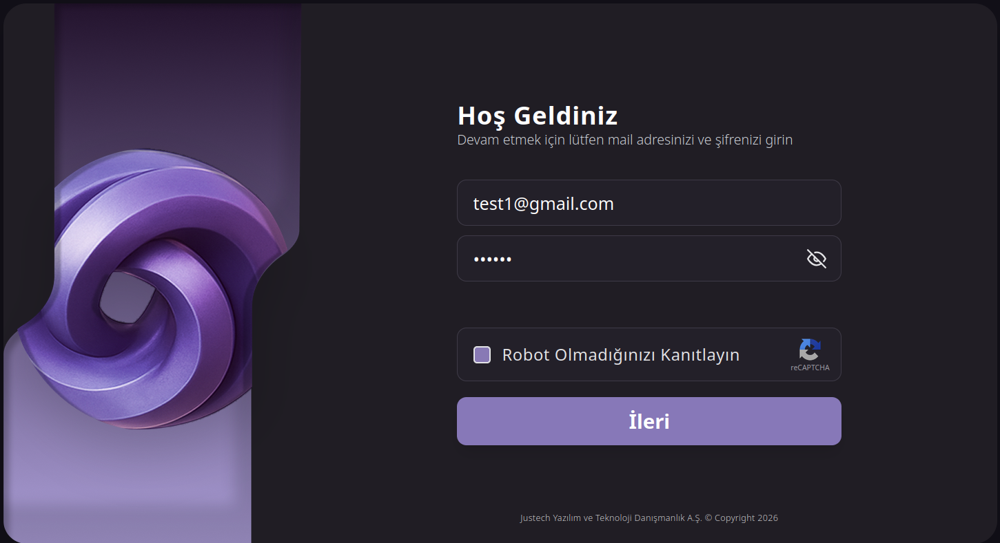
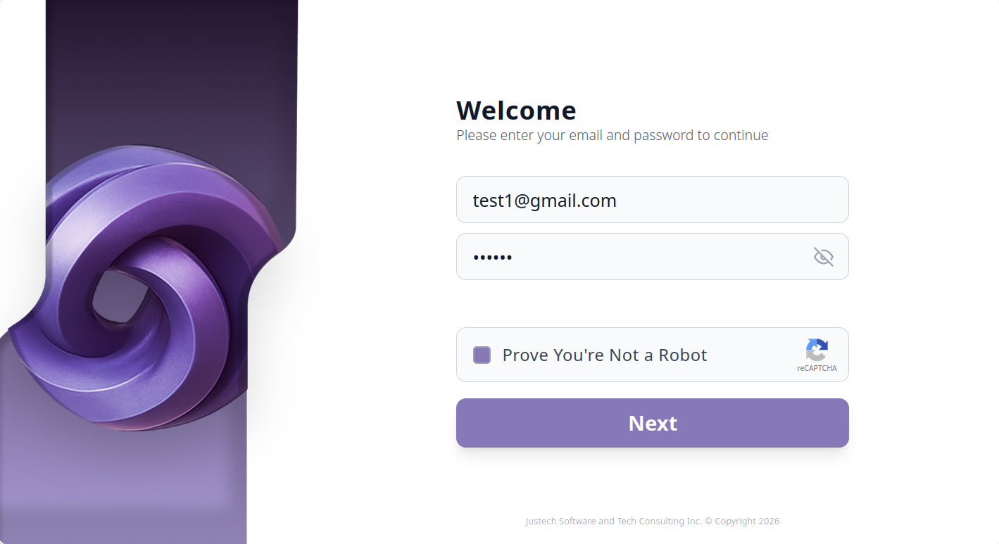
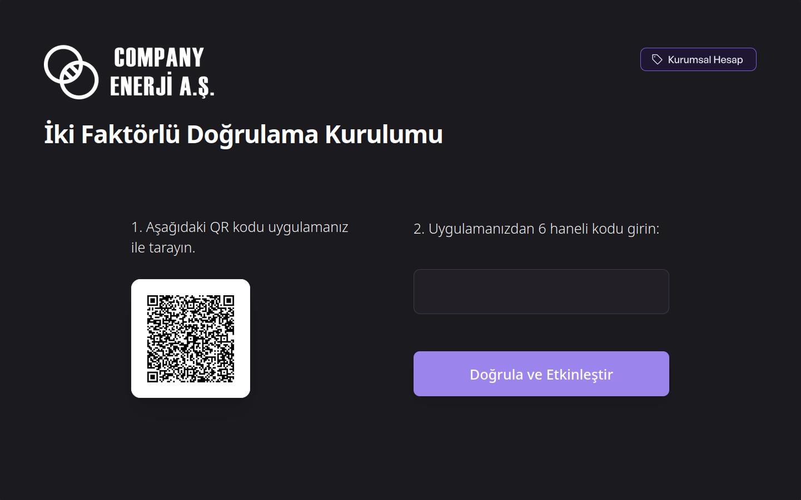
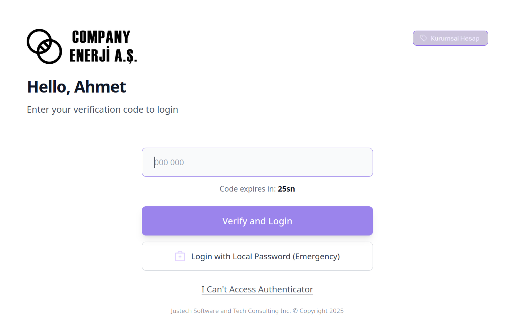
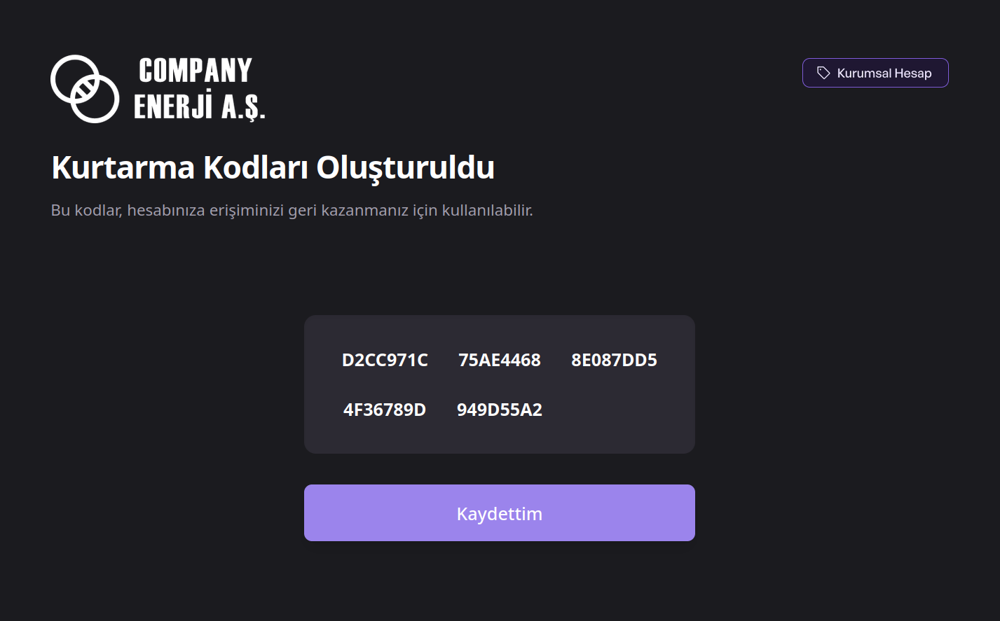
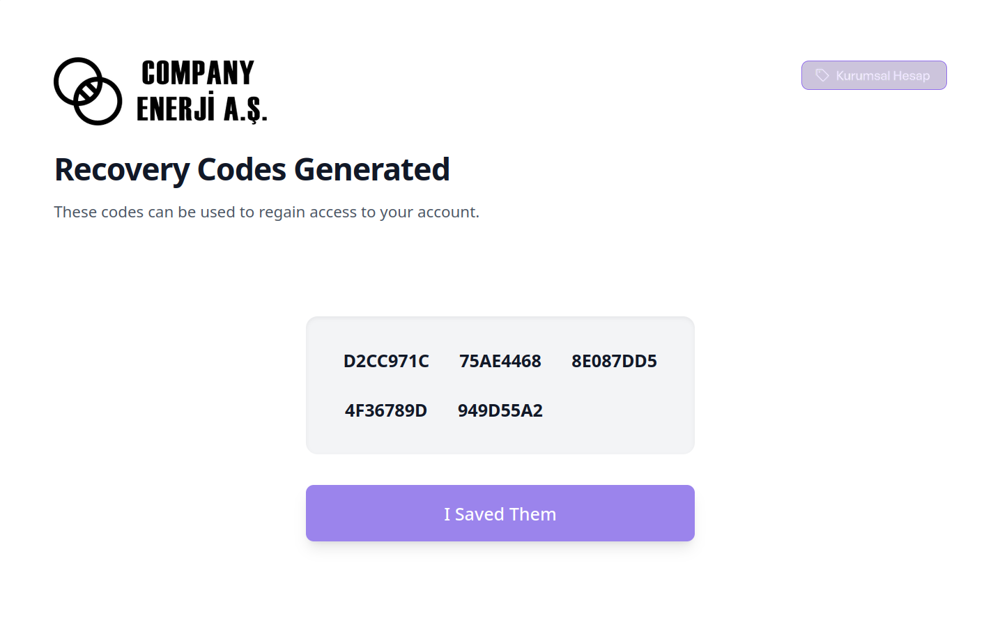
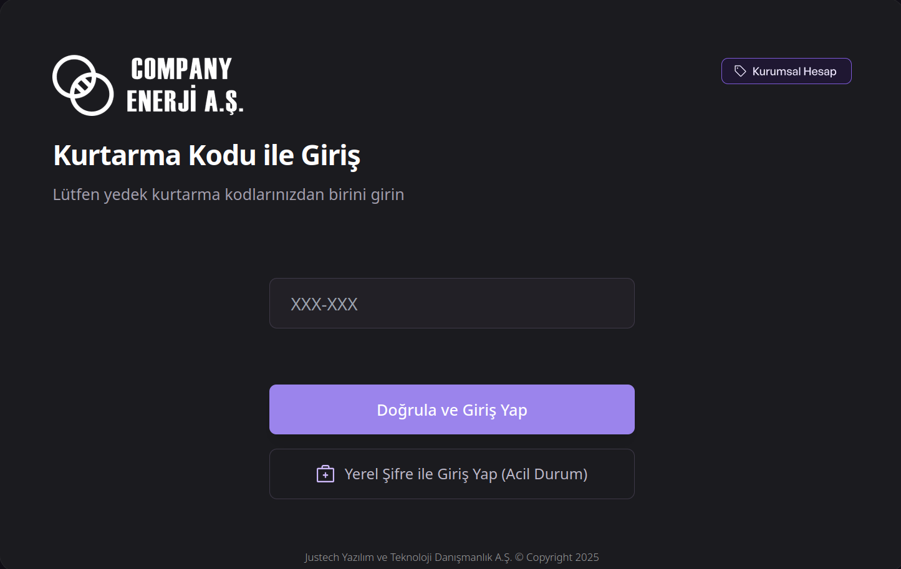
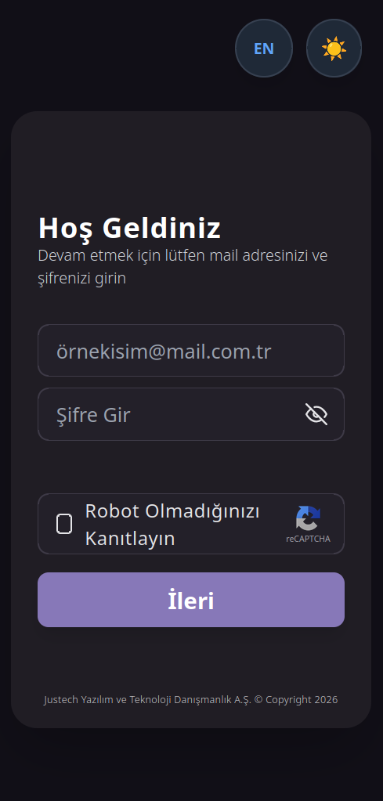

# Solar Portfolio Platform - Secure Authentication & MFA System

This project is a highly secure, multi-step authentication module developed as a Full-Stack Case Study for a solar power plant management platform. It features a robust architecture with Two-Factor Authentication (MFA), Recovery Codes, and a pixel-perfect responsive UI.

## 🚀 Tech Stack
- **Frontend:** Angular 17, Tailwind CSS, RxJS
- **Backend:** C# ASP.NET Core 8 Web API, Entity Framework Core
- **Database:** PostgreSQL (Code-First Approach)
- **Security:** BCrypt (Password Hashing), Otp.NET (TOTP Algorithm), QRCoder

## 📸 Screenshots

### Login & Registration
| Dark Mode (TR) | Light Mode (EN) |
| :---: | :---: |
|  |  |

### Multi-Factor Authentication (MFA)
| QR Code Setup (TR) | MFA Verification (EN) |
| :---: | :---: |
|  |  |

### Recovery Codes & Emergency Access
| Recovery Codes Generated (TR) | Recovery Codes Generated (EN) |
| :---: | :---: |
|  |  |

### System Access & Mobile View
| Kurtarma Kodu ile Giriş (TR) | Responsive Mobile View |
| :---: | :---: |
|  |  |

## 🔑 Key Features
- **Secure Email & Password Login:** Passwords are encrypted and stored using the BCrypt hashing algorithm.
- **MFA Setup:** Generates a Google Authenticator compatible QR code upon first login.
- **Recovery Codes:** Generates 5 single-use backup codes for emergency access when the authenticator app is unavailable.
- **Time Drift Tolerance:** Implemented a custom verification window in C# to tolerate slight time synchronization differences between the server and the user's mobile device.

## 🌟 Bonus Features Implemented
- **Responsive UI:** Flexible design that adapts flawlessly to all devices (Mobile/Tablet/Desktop).
- **Dark / Light Mode:** Instant and smooth theme switching supported by LocalStorage.
- **Multi-Language Support (i18n):** Dynamic text translation between Turkish and English.
- **Pixel-Perfect Design:** Millimetric alignment with the provided Figma design.

---
*Developed by Seher Ulutaş*